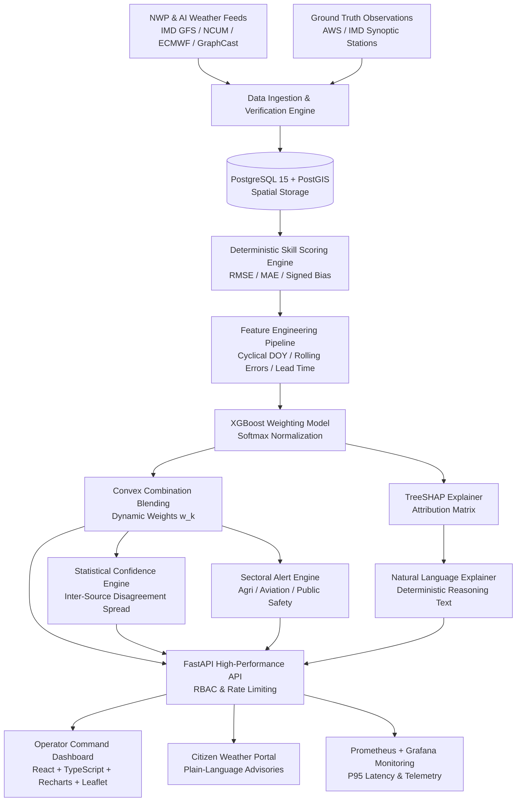

# VaruNet System Architecture Specification

## 1. High-Level Architecture Overview

VaruNet is a hybrid Artificial Intelligence – Numerical Weather Prediction (AI–NWP) multi-model meteorological blending platform built to resolve Smart India Hackathon problem statement **SIH26081**. The system dynamically synthesizes predictions from four distinct numerical and machine-learning weather prediction sources:
- **IMD GFS** (India Meteorological Department Global Forecast System)
- **NCMRWF Unified Model (NCUM)** (National Centre for Medium Range Weather Forecasting)
- **ECMWF IFS** (European Centre for Medium-Range Weather Forecasts Integrated Forecasting System)
- **GraphCast** (DeepMind Machine Learning Weather Model)

VaruNet dynamically calculates situational, spatio-temporally varying weights using a multi-output Gradient Boosted Decision Tree (**XGBoost**) trained on retrospective historical skill, with local feature attribution explanations generated via **TreeSHAP** and deterministic statistical confidence intervals.

---

## 2. Core Subsystems

### 2.1 Database Layer (PostgreSQL 15 + PostGIS)
All geospatial boundaries and meteorological datasets are stored in PostGIS with strict referential integrity across 10 tables:
1. `forecast_sources`: Registry of operational NWP and AI model feeds (`imd_gfs`, `ncmrwf_ncum`, `ecmwf_ifs`, `graphcast`).
2. `regions`: Indian meteorological subdivisions with PostGIS polygon geometry (`geom GEOMETRY(MultiPolygon, 4326)`).
3. `forecasts`: Canonical raw forecasts with composite index `(source_id, region_id, valid_time, lead_time_bucket)`.
4. `observations`: Synoptic ground-truth observations from automated weather stations.
5. `weather_regimes`: Synoptic regime classifications (Active Monsoon, Break Monsoon, Western Disturbance, etc.).
6. `skill_scores`: Deterministic multi-dimensional evaluation strata with composite primary key `(source_id, region_id, regime_id, season, lead_time_bucket, metric_date)`.
7. `blended_forecasts`: Inferred ensemble forecasts, dynamic weight vectors, and confidence metrics.
8. `explanations`: SHAP feature attributions and deterministic human-readable justification strings.
9. `alerts`: Threshold-triggered, color-coded early warnings with sector-specific guidance.
10. `users`: Forecaster, administrator, and citizen accounts with bcrypt-hashed credentials and RBAC.

### 2.2 Skill Scoring Engine (`backend/app/services/skill_scoring_engine.py`)
Deterministic statistical scoring is performed without black-box ML metrics libraries:
- **Root Mean Squared Error (RMSE)**: \(\sqrt{\frac{1}{N}\sum_{i=1}^N (f_i - o_i)^2}\)
- **Mean Absolute Error (MAE)**: \(\frac{1}{N}\sum_{i=1}^N |f_i - o_i|\)
- **Signed Bias**: \(\frac{1}{N}\sum_{i=1}^N (f_i - o_i)\)
- **Sample Sufficiency Guard**: Strata with fewer than `MIN_SAMPLE_SIZE = 10` samples are skipped and logged to prevent statistical skew.

### 2.3 Machine Learning Weighting Engine (`ml/`)
- **Model**: MultiOutput XGBoost Regressor (`XGBRegressor`) trained on historical rolling skill, cyclical day-of-year embeddings (\(\sin, \cos\)), regional coordinates, and inter-source variance.
- **Retrospective Optimal Ground Truth**: Formulated as a constrained quadratic program (\(\min_w \|F w - o\|_2^2\) s.t. \(\sum w_i = 1, w_i \ge 0\)).
- **Evaluation**: VaruNet achieves a **+7.63% RMSE improvement** and **+8.16% MAE improvement** over naive equal weighting (1/K ensemble), and outperforms individual NWP models by **39.0%**.

### 2.4 Explainability Engine (`ml/explainability/shap_explainer.py`)
- Utilizes `shap.TreeExplainer` on the trained XGBoost tree ensemble to extract local Shapley attribution values for each forecast source.
- Categorizes attributions into dominant lead cases (>15% margin) and close-competition cases, transforming attributions into verifiable natural-language justifications without hallucination.

### 2.5 Statistical Confidence Estimation
VaruNet computes confidence directly from inter-source variance and spread:
\[
\text{Confidence} = \exp\left(-\frac{\text{Inter-Source Dispersion}}{\text{Scaling Parameter}}\right)
\]
High model convergence results in confidence near 1.0, while divergence triggers calibrated lower scores and warning flags.

### 2.6 Custom RBAC & Security (`backend/app/auth/`)
- Token standard: RFC 7519 HMAC-SHA256 (HS256) JSON Web Tokens.
- Access control enforced via FastAPI route dependencies:
  - `forecaster` and `admin`: Unrestricted access to raw skill scores, weight maps, and operator dashboards.
  - `citizen`: Scoped access to plain-language summaries and public safety alerts with token-bucket rate limiting.
- Health check endpoint (`/`) remains unauthenticated for PaaS liveness probes.

### 2.7 Frontend Client (`frontend/`)
- Built with **React 18 + TypeScript + Vite**.
- Unified charting engine: **Recharts** for all time-series, bar comparisons, and skill evolution charts.
- Geospatial mapping: **Leaflet** (`react-leaflet`) for interactive vector polygon visualization of Indian meteorological divisions.
- Split UI: Operator Command Dashboard vs. Citizen Public Safety Portal.
